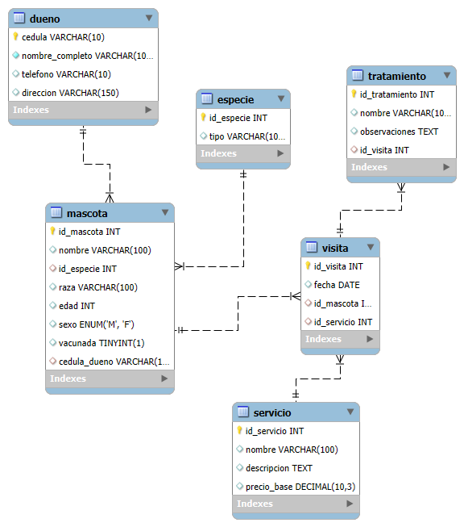

# Proyecto Base de Datos Veterinaria

## Descripción General

Este proyecto implementa una base de datos para la gestión de una **veterinaria**, permitiendo el registro y administración de dueños, mascotas, especies, servicios, visitas y tratamientos. El objetivo es facilitar el manejo de información clínica, comercial y administrativa para clínicas veterinarias.

---

## **Diseño de la Base de Datos**

### Entidades Principales

1. **Dueno**
   - Representa a los propietarios de las mascotas.
   - Campos: cédula, nombre completo, teléfono, dirección.

2. **Especie**
   - Define el tipo de animal (Perro, Gato, Reptil, etc.).
   - Campos: id_especie, tipo.

3. **Mascota**
   - Representa a cada animal registrado en la veterinaria.
   - Campos: id_mascota, nombre, especie, raza, edad, sexo, vacunada, cédula del dueño.

4. **Servicio**
   - Servicios ofrecidos por la veterinaria (baño, consulta, vacunación, etc.).
   - Campos: id_servicio, nombre, descripción, precio base.

5. **Visita**
   - Registra cada visita de una mascota a la clínica y el servicio recibido.
   - Campos: id_visita, fecha, mascota, servicio.

6. **Tratamiento**
   - Detalla los tratamientos aplicados durante una visita específica.
   - Campos: id_tratamiento, nombre, observaciones, id_visita.

---

### Relaciones

- **Un dueño** puede tener **varias mascotas**.
- **Una mascota** pertenece a **una especie** y a **un dueño**.
- **Una visita** está asociada a **una mascota** y un **servicio**.
- **Un tratamiento** está vinculado a **una visita**.

---

## **Diagrama UML ER**

---

## **Proceso de Implementación**

1. **Creación de la base de datos:**  
   Se crea la base de datos con el nombre `veterinaria`.

2. **Definición de tablas:**  
   Se definen primero las tablas independientes (Dueno, Especie, Servicio) y luego las dependientes (Mascota, Visita, Tratamiento) respetando las claves foráneas.

3. **Inserción de datos:**  
   Se insertan registros de ejemplo en todas las tablas para simular información real y permitir pruebas de consultas.

4. **Consultas avanzadas:**  
   Se desarrollan consultas SQL para obtener información relevante de la base de datos, utilizando funciones de agregación, alias, manipulaciones de texto, cálculos y condiciones.

---

## **Consultas**

Se incluyen un conjunto de consultas SQL que resuelven necesidades reales de información para la veterinaria, por ejemplo:
- Listar mascotas y sus dueños para campañas personalizadas.
- Calcular la edad promedio de mascotas atendidas.
- Identificar los servicios más solicitados y costosos.
- Generar listados de mascotas vacunadas o pendientes de vacunación.
- Obtener estadísticas por especie, por edad y por servicio.

---

## **Video Explicativo**

[Video Explicativo](https://drive.google.com/file/d/1BPYOq5O55F6AkqusBlWEGpmeYDjfXtWo/view?usp=sharing)

**Autor:**  
Davisson Adriel

